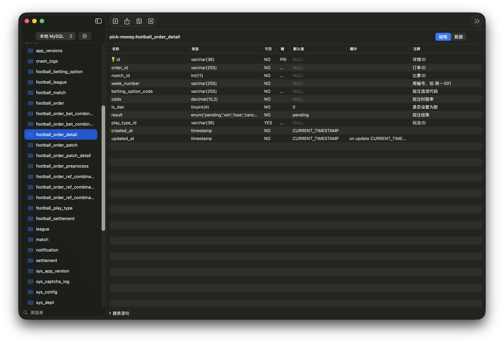
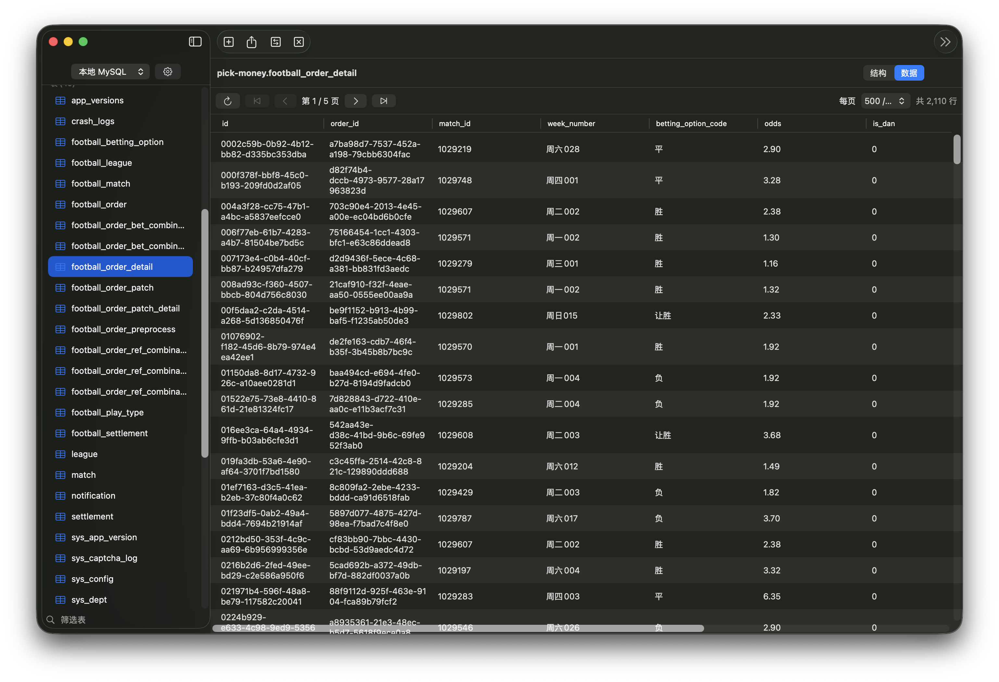
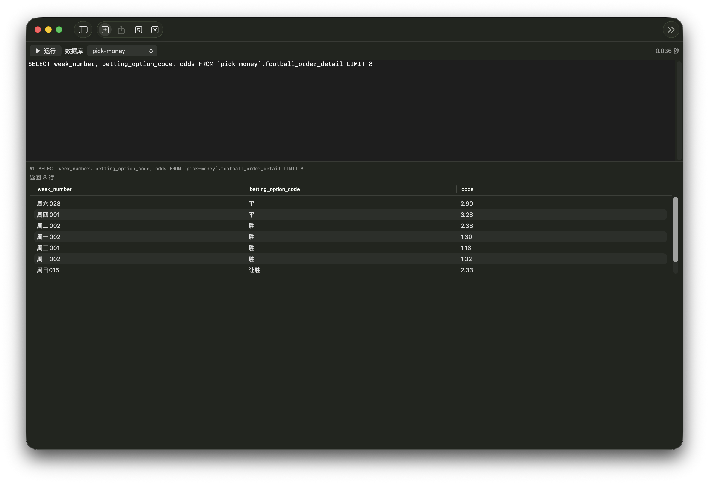
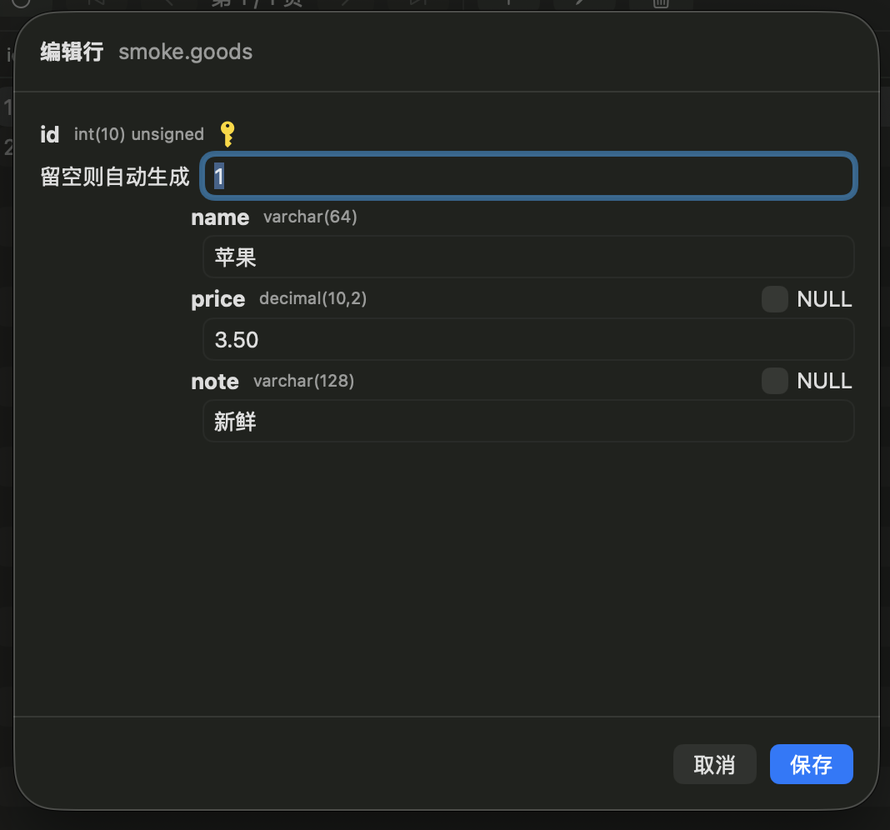

# MyNavicat

用 **Swift 原生**(SwiftUI + mysql-nio）开发的迷你版 Navicat Premium，先支持 **MySQL**。
不追求原版的复杂度，专注六件事：**连接、看表结构、看数据、改数据、查询、导出、跨库迁移**。



## 功能

| 功能 | 说明 |
| --- | --- |
| 连接管理 | 多连接增删改、测试连接、默认数据库；配置持久化，密码存系统 Keychain（旧版明文自动迁移） |
| 连接侧栏 | 「我的连接」平铺全部连接，展开即连接（绿点标记），可折叠；库下分 表/视图 两类，支持筛选 |
| 对象视图 | 点选数据库后右侧列出全部对象：名称/行/数据长度/引擎/创建日期/修改日期/排序规则/注释；按列排序、搜索、多选、双击/回车打开 |
| 表结构 | 列名/类型/可空/键/默认值/EXTRA/注释，附完整建表语句 |
| 数据浏览 | 分页网格（100/500/2000 每页）,NULL 斜体显示，BIT 显示为整数，BLOB 显示为 `0x` 十六进制 |
| 数据编辑 | 行编辑/新增/删除（按主键定位，`LIMIT 1` 兜底）；可空列可置 NULL，自增/生成列留空走数据库默认；无主键表自动只读 |
| SQL 查询 | 多语句脚本执行（`⌘+回车`)，逐条显示结果集/影响行数/错误，数据库上下文选择器 |
| 导出 | CSV / JSON / SQL(INSERT 语句，含 DROP+CREATE，可在任意库重放），原子写文件 |
| 跨库迁移 | **拖拽即迁移**：对象视图选中表拖到侧栏任意数据库（可跨连接）；也支持右键「迁移到…」；自动建库、结构+数据、逐表日志；视图自动识别 |

| 数据浏览 | SQL 查询 | 数据编辑 |
| --- | --- | --- |
|  |  |  |

## 运行

要求：macOS 14.4+,Xcode 16 / Swift 6.2+,MySQL 5.7 或 8.x。

```sh
# 打包出 MyNavicat.app(默认 debug;release 用 ./make_app.sh release)
./make_app.sh
open MyNavicat.app

# 或者不打包直接跑
swift run MyNavicat
```

首次启动会预置一个本机连接（`root / 123456 @ 127.0.0.1:3306`)，在「管理连接」里修改成你的。

## 使用

- **浏览**：侧栏双击连接名（或点展开箭头）即连接并列出库；点库名/「表」在右侧打开对象视图
- **打开表**：对象视图双击（或回车）行，或侧栏展开库 → 表 → 点表名，即开标签页（结构/数据切换）
- **迁移**：对象视图选中表（⌘/⇧ 多选）→ 直接拖到左侧目标数据库；或右键「迁移到…」；目标库可选已有库或「新建数据库…」
- **新建查询**：工具栏「新建查询」；`⌘+回车` 运行，`⌘+⇧+W` 关闭标签页
- **编辑**：数据页选中行 → 工具栏「编辑」（或「删除」，需确认）；「+」新增行；无主键的表/视图为只读
- **导出**：选中表标签页 → 工具栏「导出」，或侧栏表名右键「导出…」

## 架构

```
Sources/
├── MyNavicatCore/          # 核心库（无 UI 依赖，可单测）
│   ├── MySQLSession.swift  #   actor 封装连接：断线重连、USE 上下文跟踪、
│   │                       #   INSERT 语句构造（转义/hex/生成列剔除）
│   ├── SQLUtils.swift      #   标识符/字符串转义、多语句切分（引号/注释感知）
│   ├── RowEditor.swift     #   行编辑：主键定位 UPDATE/DELETE、INSERT，
│   │                       #   展示值/用户输入 -> SQL 字面量（NULL/hex 感知）
│   ├── PasswordStore.swift #   密码存储抽象：系统 Keychain + 内存实现（测试注入）
│   ├── Exporter.swift      #   CSV/JSON/SQL 流式导出，临时文件+原子替换
│   ├── Migrator.swift      #   跨库迁移：事务包裹、外键检查开关、视图 DEFINER 剥离
│   ├── ConnectionStore.swift
│   └── Models.swift
├── MyNavicat/              # SwiftUI 应用
│   ├── AppState.swift      #   多连接状态：连接节点/表缓存/标签页（携带连接上下文）
│   ├── ContentView.swift   #   「我的连接」树形侧栏 + 标签页容器 + 拖放目标
│   ├── ObjectView.swift    #   对象视图：八列排序表、多选、双击/回车打开、拖拽源
│   ├── TableViews.swift    #   结构/数据网格
│   ├── QueryView.swift     #   查询编辑器
│   └── Sheets.swift        #   连接管理/导出/迁移面板
Tests/MyNavicatCoreTests/   # 23 个集成测试（真实连接 MySQL）+ 5 个存储单测
```

关键技术点：

- **mysql-nio** 纯 Swift 驱动，文本协议用于结果集（保留原始显示格式），预处理协议用于 DML/DDL 拿 `affectedRows`;`SET`/`BEGIN` 等不支持预处理的语句自动路由回文本协议
- **二进制安全**:BLOB/BINARY 按字符集标志识别，导出/迁移用 `X'hex'` 字面量，BIT 转无符号整数，往返不丢数据
- **迁移安全**：同连接同库 = 源时拒绝执行（否则会先 DROP 源表）；每表数据在一个事务里，失败整体回滚；复制期间 `FOREIGN_KEY_CHECKS=0`;GENERATED ALWAYS 列自动剔除

## 测试

```sh
swift test   # 默认连 127.0.0.1:3306 root/123456
# 用环境变量覆盖：
MYNAVICAT_HOST=... MYNAVICAT_PORT=... MYNAVICAT_USER=... MYNAVICAT_PASS=... swift test
```

测试会创建/销毁 `mynavicat_test_a`、`mynavicat_test_b` 两个临时库，覆盖：连接、元数据、结构、分页、DML、中文/NULL/BLOB/BIT 往返、三种格式导出、SQL 重放、跨库迁移、生成列、同库防护、行编辑/新增/删除、无主键拒绝。存储单测覆盖：密码不落盘、旧版明文迁移、Keychain 优先、删除连接清理密码。

## 已知限制

- 大表导出/迁移使用 `LIMIT/OFFSET` 分页；源表有并发写入时可能重行/漏行（大表建议低峰期操作）
- 无主键的表/视图不支持行编辑/删除（新增仍可用，服务端报错直接透出）
- 查询结果为空时不显示表头（mysql-nio 空结果集不携带列元数据）
- 迁移范围不含触发器/存储过程/事件
- 多语句切分不支持 `DELIMITER`（存储过程脚本）

## 路线图

- [ ] PostgreSQL 支持
- [x] 数据编辑（单元格增删改）
- [ ] 收藏查询 / 查询历史
- [x] Keychain 存储密码
- [ ] SSH 隧道连接
